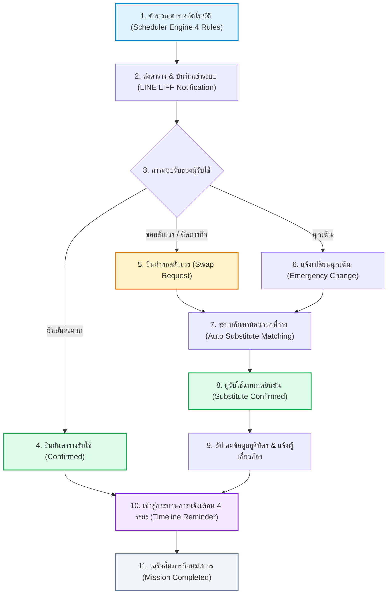
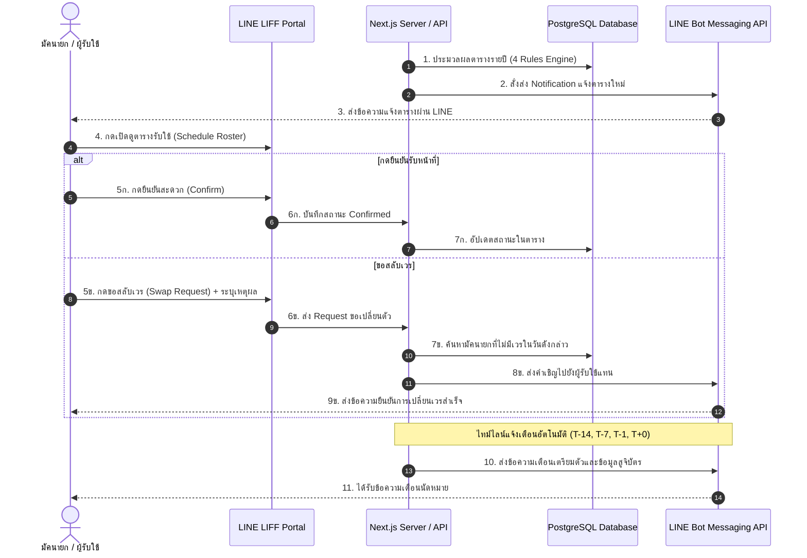

# แผนผังกระบวนการทำงานระบบตารางรับใช้ (Serving Roster Workflow)
**คริสตจักรไมตรีจิต 1837 — MTC Staff Management System**

---

## 1. แผนผังกระบวนการทำงานรวม (End-to-End Workflow Diagram)

---

## 2. ลำดับการสื่อสารระหว่างระบบ (Sequence Diagram)

---

## 3. กรณีการใช้งานหลัก 3 รูปแบบ (3 Core Scenarios)

### กรณีที่ 1: การตอบรับและปฏิบัติหน้าที่ตามปกติ (Standard Confirmation Flow)
1. มัคนายกได้รับแจ้งตารางผ่าน LINE
2. เปิดดูตารางผ่าน LINE LIFF พอร์ทัล
3. กดยืนยันรับหน้าที่ (`confirmed`)
4. ระบบส่งข้อความแจ้งเตือนอัตโนมัติ 4 ระยะ
5. ร่วมปฏิบัติหน้าที่ในวันอาทิตย์ตามเวลา 08:30 น.

### กรณีที่ 2: การขอสลับเวรล่วงหน้า (Swap Duty Request Flow)
1. มัคนายกติดภารกิจ (เช่น ไปรับใช้ต่างจังหวัด)
2. กดปุ่ม **"ขอสลับเวร (Swap)"** ในระบบพร้อมระบุเหตุผล
3. ระบบค้นหามัคนายกที่ว่างในวันดังกล่าวโดยอัตโนมัติ
4. ผู้รับใช้แทนตอบรับหน้าที่
5. ระบบอัปเดตข้อมูลส่งให้ทีมธุรการจัดทำสูจิบัตร

### กรณีที่ 3: การเปลี่ยนตัวกรณีฉุกเฉิน (Emergency Change Flow)
1. เกิดเหตุสุดวิสัยกะทันหันก่อนวันอาทิตย์
2. กดแจ้งเหตุฉุกเฉินในระบบ
3. ระบบส่งสัญญาณแจ้งเตือนไปยังประธานมัคนายกและทีมบริหารทันที
4. มอบหมายผู้รับใช้สำรองเข้าประจำจุดแทนอย่างทันท่วงที

---

## 4. ไทม์ไลน์การแจ้งเตือนอัตโนมัติ 4 ระยะ (Automated Reminder Timeline)

| ระยะเวลา | ประเภทการแจ้งเตือน | ตัวอย่างข้อความ | กลุ่มเป้าหมาย |
| :--- | :--- | :--- | :--- |
| **T-14 วัน** (2 สัปดาห์ก่อนหน้า) | แจ้งเตือนเตรียมตัวรับใช้ | *"ขอแจ้งตารางรับใช้ล่วงหน้า เพื่อให้ท่านจัดสรรเวลาและเตรียมจิตใจในการปรนนิบัติ"* | ผู้รับใช้ทุกคนในสัปดาห์นั้น |
| **T-7 วัน** (1 สัปดาห์ก่อนหน้า) | แจ้งส่งข้อมูลสูจิบัตร / Pre-work | *"กรุณาส่งหัวข้อ ข้อพระธรรม หรือข้อมูลผู้นำนมัสการเพื่อจัดทำสูจิบัตร"* | ผู้เทศนา, ผู้นำนมัสการ, ผู้แปล |
| **T-1 วัน** (1 วันก่อนหน้า) | แจ้งยืนยันรอบพรุ่งนี้ | *"พรุ่งนี้เราร่วมรับใช้ด้วยกันในพระนิเวศ นัดหมายพร้อมกันเวลา 08:30 น."* | มัคนายกและทีมงานประจำจุดทั้งหมด |
| **T+0 คืนวันอาทิตย์** (เสร็จสิ้นงาน) | ข้อความขอบคุณ & เสริมกำลัง | *"ขอพระเจ้าเสริมกำลังและอวยพระพรสำหรับการปรนนิบัติรับใช้ในวันนี้"* | ผู้รับใช้ทุกคนที่ปฏิบัติหน้าที่ |

---

## 5. เกณฑ์และกฎ 4 ข้อในการจัดตาราง (Scheduling Engine Rules)

1. **กฎข้อที่ 1 (วันพิเศษตรงฝ่าย):** กำหนดให้มัคนายกประจำฝ่ายเป็นผู้นำนมัสการในวันสำคัญประจำปีของฝ่ายตนเอง (เช่น วันอนุชน ➔ มน.อนุชน, วันสตรี ➔ มน.สตรี)
2. **กฎข้อที่ 2 (ลำดับสถานที่):** จัดสรรตามลำดับความสำคัญ: โบสถ์บน/ล่าง (Priority 1) ➔ ประตูทางเข้าใหญ่ (Priority 2) ➔ ห้องทิโมธี (Priority 3)
3. **กฎข้อที่ 3 (โควตาไม่เกิน 2 ครั้ง/เดือน):** จำกัดความถี่ในการรับใช้ไม่เกิน 2 สัปดาห์ต่อเดือนต่อท่าน เพื่อป้องกันภาระงานที่หนักเกินไปและกระจายการมีส่วนร่วม
4. **กฎข้อที่ 4 (ป้องกันตารางชน):** ตรวจสอบวันลาที่ได้รับอนุมัติในระบบ และป้องกันการจัดเวรซ้ำซ้อนในวันเดียวกัน
